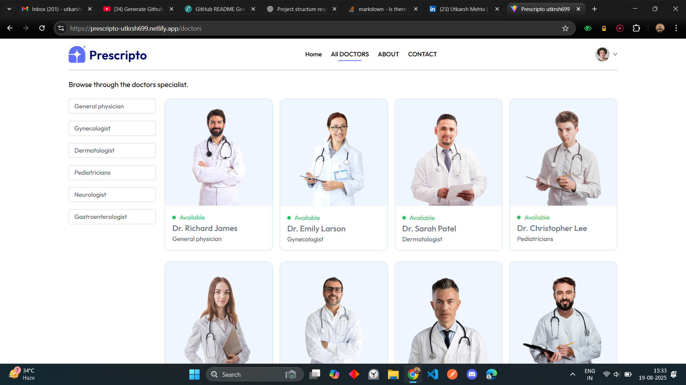

# Prescripto - Your Doctor Appointment Website 🏥

<!-- Badges -->


<!-- Description -->
Prescrito is a simple website where you can easily manage your healthcare! It's like having all your doctor-related stuff in one convenient place. You can find doctors near you, book appointments without any hassle, and even pay securely online. Plus, if you need help finding the right doctor, our friendly chatbot is there to guide you!

**Check out Prescripto!**

*   **See it as a User:** [User View](https://hms24-prescripto-utkrsh699.netlify.app)
*   **For Doctors and Admins:** [Admin/Doctor Panel](https://hms24-prescripto-admin-utkrsh699.netlify.app)


## Screenshots
 

   




<!-- Table of Contents -->

## Table of Contents
- [Description](#description)
- [Features](#features)
- [Tech Stack](#tech-stack)
- [Installation](#installation)
- [Usage](#usage)
- [How to use](#how-to-use)
- [Project Structure](#project-structure)
- [API Reference](#api-reference)
- [Contributing](#contributing)
- [License](#license)
- [Important links](#important-links)
- [Footer](#footer)


## Description
The Doctor Appointment System (HMS24) is a full-stack application built with JavaScript, React, Node.js, Express, and MongoDB. It offers a user-friendly interface for administrators, doctors, and patients to manage various aspects of hospital operations, including appointment scheduling, doctor profiles, and online payments. The system also integrates with Google's Gemini AI to provide doctor suggestions based on patient symptoms.


## Features ✨
- 👨‍⚕️ **Admin Panel**: Manage doctors and appointments.
- 🩺 **Doctor Panel**: Manage appointments and profile.
- 👤 **User Panel**: Book appointments, manage profiles, and make payments.
- 🤖 **AI-Powered Doctor Suggestions**: Get doctor recommendations based on symptoms using Google Gemini.
- 💳 **Payment Integration**: Razorpay integration for online payments.


## Tech Stack 💻
- **Frontend**: React.js, JavaScript, Vite, Tailwind CSS
- **Backend**: Node.js, Express, MongoDB
- **AI**: Google Gemini
- **Payment**: Razorpay
- **Other**: bcryptjs, cloudinary, cors, dotenv, jsonwebtoken, mongoose, multer, validator


## Important links 🔗
-   User's Profile Link : [User](https://github.com/SETAN747)
-   Repository Link: [https://github.com/SETAN747/HMS24](https://github.com/SETAN747/HMS24)
-   Linkedin Link :[Utkarsh Mehta](https://www.linkedin.com/in/utkarshmehta699)


## Installation 🚀
Follow these steps to set up the project locally:

1.  Clone the repository: `git clone https://github.com/SETAN747/HMS24.git`
2.  Navigate to the 'admin' directory: `cd admin`
3.  Install dependencies using npm: `npm install`
4.  Start the development server: `npm run dev`
5.  Navigate to the 'frontend' directory: `cd frontend`
6.  Install dependencies using npm: `npm install`
7.  Start the development server: `npm run dev`
8.  Navigate to the 'backend' directory: `cd backend`
9.  Install dependencies using npm: `npm install`
10. Set up environment variables. Create a `.env` file in the backend directory and add the following variables: `MONGODB_URI`, `ALLOWED_ORIGINS`, `ADMIN_EMAIL`, `ADMIN_PASSWORD`, `JWT_SECRET`, `CLOUDINARY_NAME`, `CLOUDINARY_API_KEY`, `CLOUDINARY_SECRET_KEY`, `GEMINI_API_KEY`, `RAZORPAY_KEY_ID`, `RAZORPAY_KEY_SECRET`, `CURRENCY`
11. Start the backend server: `npm run server`


## How to Use Prescripto 💡

Prescripto is designed to bring together the best doctors in one place, making it super easy for you to book appointments quickly!

Here's a simple guide on how to use it:

1.  **Admin Panel:** If you're an admin, you can get into the Admin Panel using the login details you'll find in the `.env` file. This is where the behind-the-scenes magic happens!
2.  **For Doctors:** Doctors can log in to see their appointments and change their profile info. Keep your profile updated so patients know your expertise!
3.  **For Users (Patients):** You can sign up and log in to book appointments and handle your profile. It's your personal space to manage your healthcare journey.
4.  **AI Chatbot:** Need help finding the right doctor? Use our clever AI chatbot! Just tell it your symptoms, and it will suggest doctors who can help.
5.  **Online Payments:** Paying for your appointment is a breeze! We use Razorpay for safe and secure online payments.


## How to use
Prescripto is designed to streamline healthcare operations and enhance the patient experience. Here's how to use it in a real-world setting:

1.  **Admin Panel**: As an admin, log in to the admin panel to manage doctors, appointments, and system settings. You can add new doctors, update their availability, and cancel or reschedule appointments as needed.
2.  **Doctor Panel**: Doctors can log in to their respective accounts to view their schedules, manage appointments, and update their profiles. They can mark appointments as completed or cancel them if necessary.
3.  **User Panel**: Patients can register and log in to book appointments with available doctors. They can search for doctors by speciality, view their profiles, and select preferred dates and times for appointments. Users can also manage their profiles and view their appointment history.
4.  **AI-Powered Chatbot**: Utilize the AI-powered chatbot to get doctor suggestions based on symptoms. Simply describe your symptoms in the chat interface, and the system will recommend appropriate doctors based on the input.
5.  **Payment Integration**: Make online payments for appointments using the integrated Razorpay payment gateway. Patients can securely pay for their appointments online, ensuring a seamless and convenient payment experience.


## Project Structure 📂

Let's explore the project's file structure! Understanding how things are organized will help you navigate the codebase.

```
admin/
│── public/             # Static assets (favicons, logos)
│── src/
│   ├── assets/         # Images, icons, static files
│   ├── components/     # Reusable UI
│   │   ├── Navbar.jsx  # Top navigation bar
│   │   └── Sidebar.jsx # Admin dashboard sidebar
│   ├── context/
│   │   ├── AdminContext.jsx # State management for admin
│   │   ├── AppContext.jsx   # Shared global state
│   │   └── DoctorContext.jsx# Doctor-related state
│   ├── pages/
│   │   ├── Admin/      # Admin dashboard pages
│   │   ├── Doctor/     # Doctor management views
│   │   └── Login.jsx   # Login page for admins
│   ├── App.jsx         # Root component
│   ├── index.css       # Styles
│   └── main.jsx        # Entry point (ReactDOM)
│── vite.config.js      # Vite config
│── tailwind.config.js  # Tailwind config
│── eslint.config.js    # Linting rules
│── package.json

backend/
│── config/
│   ├── cloudinary.js   # Cloudinary (image storage)
│   ├── gemini.js       # AI/Chatbot integration (Google Gemini API)
│   ├── mongodb.js      # MongoDB connection
│   └── razorpay.js     # Razorpay (payment gateway)
│
│── controllers/        # Route logic (separates API logic)
│   ├── adminControllers.js
│   ├── doctorController.js
│   └── userController.js
│
│── middlewares/
│   ├── authAdmin.js    # Auth middleware for admins
│   ├── authDoctor.js   # Auth middleware for doctors
│   ├── authUser.js     # Auth middleware for users
│   └── multer.js       # File upload handler
│
│── models/             # Mongoose models (MongoDB schemas)
│   ├── appointmentModel.js
│   ├── doctorModel.js
│   └── userModel.js
│
│── routes/             # API endpoints
│   ├── adminRoute.js   # Admin routes
│   ├── doctorRoute.js  # Doctor routes
│   └── userRoute.js    # User routes
│
│── server.js           # Express server entry
│── vercel.json         # Vercel deployment config
│── package.json


frontend/
│── public/             # Static assets
│── src/
│   ├── assets/         # Images, icons
│   ├── components/     # Reusable UI
│   │   ├── Banner.jsx
│   │   ├── Footer.jsx
│   │   ├── Header.jsx
│   │   ├── Navbar.jsx
│   │   ├── RelatedDoctors.jsx
│   │   ├── SpecialityMenu.jsx
│   │   └── TopDoctors.jsx
│   ├── context/
│   │   └── AppContext.jsx # Global app state (auth, doctors, appointments)
│   ├── pages/
│   │   ├── About.jsx
│   │   ├── Appointment.jsx
│   │   ├── Chatbot.jsx     # AI chatbot page
│   │   ├── Contact.jsx
│   │   ├── Doctors.jsx
│   │   ├── Home.jsx
│   │   ├── Login.jsx
│   │   ├── MyAppointments.jsx
│   │   └── MyProfile.jsx
│   ├── App.jsx         # Root component
│   ├── App.css         # Styles
│   ├── index.css
│   └── main.jsx        # Entry point
│── vite.config.js
│── tailwind.config.js
│── postcss.config.js
│── eslint.config.js
│── package.json


## API Reference 🌐


### Admin Routes:
-   `POST /api/admin/add-doctor`: Add a new doctor (requires admin authentication).
-   `POST /api/admin/login`: Log in as an admin.
-   `POST /api/admin/all-doctors`: Get a list of all doctors (requires admin authentication).
-   `POST /api/admin/change-availability`: Change doctor availability (requires admin authentication).
-   `GET /api/admin/appointments`: Get a list of all appointments (requires admin authentication).
-   `POST /api/admin/cancel-appointment`: Cancel an appointment (requires admin authentication).
-   `GET /api/admin/dashboard`: Get dashboard data (requires admin authentication).


### Doctor Routes:
-   `GET /api/doctor/list`: Get a list of doctors.
-   `POST /api/doctor/login`: Log in as a doctor.
-   `GET /api/doctor/appointments`: Get a list of appointments for the doctor (requires doctor authentication).
-   `POST /api/doctor/complete-appointment`: Mark an appointment as completed (requires doctor authentication).
-   `POST /api/doctor/cancel-appointment`: Cancel an appointment (requires doctor authentication).
-   `GET /api/doctor/dashboard`: Get dashboard data for the doctor (requires doctor authentication).
-   `GET /api/doctor/profile`: Get doctor profile (requires doctor authentication).
-   `POST /api/doctor/update-profile`: Update doctor profile (requires doctor authentication).


### User Routes:
-   `POST /api/user/register`: Register a new user.
-   `POST /api/user/login`: Log in as a user.
-   `GET /api/user/get-profile`: Get user profile (requires user authentication).
-   `POST /api/user/update-profile`: Update user profile (requires user authentication).
-   `POST /api/user/book-appointment`: Book an appointment (requires user authentication).
-   `GET /api/user/appointments`: Get a list of appointments for the user (requires user authentication).
-   `POST /api/user/cancel-appointment`: Cancel an appointment (requires user authentication).
-   `POST /api/user/payment-razorpay`: Initiate a Razorpay payment (requires user authentication).
-   `POST /api/user/verify-razorpay`: Verify a Razorpay payment (requires user authentication).
-   `POST /api/user/get-doctor-suggestions`: Get doctor suggestions based on symptoms (requires user authentication).


## Contributing 🤝
Contributions are welcome! Please follow these steps:

1.  Fork the repository.
2.  Create a new branch for your feature or bug fix.
3.  Make your changes and commit them with descriptive messages.
4.  Push your changes to your fork.
5.  Submit a pull request to the main repository.


## Footer 📜
This README was generated for [HMS24](https://github.com/SETAN747/HMS24) repository. Feel free to contribute, fork, like, open issues, and star the repository!
